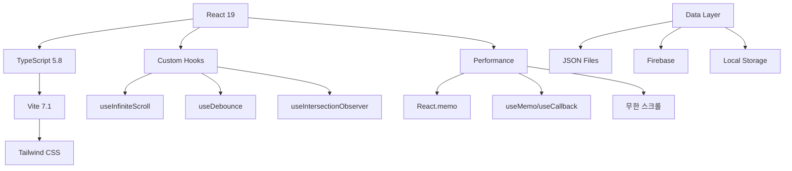

<div align="center">

# 🐾 Stone Age Light - Pet Encyclopedia

<p align="center">
  
</p>

<p align="center">
  <strong>스톤에이지 환수강림의 완전한 펫 데이터베이스</strong><br/>
  🔍 실시간 검색 • 🎯 스마트 필터링 • 📱 모바일 최적화 • 🌙 다크모드
</p>

<p align="center">
  <a href="https://github.com/flowerjunho/stoneage-light/stargazers">
    
  </a>
  <a href="https://github.com/flowerjunho/stoneage-light/network">
    
  </a>
  <a href="https://github.com/flowerjunho/stoneage-light/issues">
    
  </a>
  <a href="https://github.com/flowerjunho/stoneage-light/blob/main/LICENSE">
    
  </a>
</p>

<p align="center">
  <a href="https://flowerjunho.github.io/stoneage-light">🚀 Live Demo</a> •
  <a href="#-주요-기능">✨ Features</a> •
  <a href="#-설치-및-실행">📦 Installation</a> •
  <a href="#-기여하기">🤝 Contributing</a>
</p>

---

</div>

## 🎯 프로젝트 소개

**Stone Age Light**는 스톤에이지 환수강림 게이머들을 위한 **현대적이고 빠른** 펫 정보 검색 플랫폼입니다.

### 🌟 왜 Stone Age Light인가?

- 🚀 **초고속 검색**: 300ms 디바운싱으로 즉시 반응하는 검색
- 🎨 **모던 UI/UX**: 다크모드, 무한스크롤, 모바일 최적화
- 📊 **스마트 필터링**: 속성, 등급, 스탯 등 다차원 필터링
- ⚡ **성능 최적화**: React 19 + TypeScript + Vite로 최적화된 성능
- 🔄 **실시간 동기화**: 모든 필터가 실시간으로 동기화

## ✨ 주요 기능

<div align="center">
  <table>
    <tr>
      <td align="center" width="33%">
        
        <h3>🔍 스마트 검색</h3>
        <p>펫 이름, 등급, 획득처를 포함한<br/>전방위 실시간 검색</p>
      </td>
      <td align="center" width="33%">
        
        <h3>🎯 멀티 필터</h3>
        <p>속성, 등급, 스탯 등<br/>다차원 필터링 시스템</p>
      </td>
      <td align="center" width="33%">
        
        <h3>📱 모바일 퍼스트</h3>
        <p>iPhone 16 Pro 최적화<br/>반응형 디자인</p>
      </td>
    </tr>
  </table>
</div>

### 🔥 핵심 기능 상세

<details>
<summary><strong>🔍 검색 및 필터링</strong></summary>

- **⚡ 실시간 검색**: 300ms 디바운싱으로 부드러운 검색 경험
- **🌍 전방위 검색**: 펫 이름, 등급, 획득처 등 모든 필드 검색
- **🎯 속성 필터**: 지(🟢), 수(🔵), 화(🔴), 풍(🟡) 4원소 필터링
- **📊 스탯 필터**: 공격/방어/순발/체력 + 성장률 범위 설정
- **⭐ 등급 필터**: S~F 등급별 세분화 필터링
- **❤️ 즐겨찾기**: 개인화된 펫 컬렉션 관리

</details>

<details>
<summary><strong>🎨 사용자 경험</strong></summary>

- **🌙 다크/라이트 테마**: 시간대별 최적화된 테마 시스템
- **♾️ 무한 스크롤**: 60개씩 점진적 로딩으로 부드러운 탐색
- **💀 스켈레톤 UI**: 로딩 시 자연스러운 플레이스홀더
- **📱 모바일 UX**: 플로팅 버튼 + 바텀시트 네이티브 경험
- **🔄 상태 동기화**: 모든 필터와 설정의 실시간 동기화

</details>

<details>
<summary><strong>🚀 성능 최적화</strong></summary>

- **⚡ React 19**: 최신 컨커런트 렌더링 최적화
- **🎯 메모이제이션**: React.memo + useMemo로 불필요한 리렌더링 차단
- **📦 코드 스플리팅**: 라우트별 지연 로딩 (계획 중)
- **🗜️ 번들 최적화**: Tree-shaking + 의존성 최적화
- **📊 성능 모니터링**: Core Web Vitals 준수

</details>

## 🛠️ 기술 스택

<div align="center">

### Frontend

[](https://reactjs.org/)
[](https://www.typescriptlang.org/)
[](https://vitejs.dev/)

### Styling & UI

[](https://tailwindcss.com/)
[](https://postcss.org/)

### Tools & Services

[](https://firebase.google.com/)
[](https://pptr.dev/)
[](https://eslint.org/)
[](https://prettier.io/)

</div>

### 🏗️ 아키텍처 특징



### 💡 핵심 기술 선택 이유

| 기술             | 선택 이유                       | 버전      |
| ---------------- | ------------------------------- | --------- |
| **React 19**     | 최신 컨커런트 기능, 성능 최적화 | `19.1.1`  |
| **TypeScript**   | 타입 안전성, 개발자 경험 향상   | `5.8.3`   |
| **Vite**         | 빠른 개발 환경, ES 모듈 지원    | `7.1.2`   |
| **Tailwind CSS** | 유틸리티 퍼스트, 빠른 스타일링  | `3.4.14`  |
| **Firebase**     | 실시간 댓글, 방문자 분석        | `12.2.1`  |
| **Puppeteer**    | 자동 데이터 수집, 스크래핑      | `24.21.0` |

## 🗂️ 데이터 구조

<div align="center">
  <table>
    <tr>
      <th>📊 데이터 타입</th>
      <th>📈 항목 수</th>
      <th>🔄 업데이트</th>
      <th>📁 파일 크기</th>
    </tr>
    <tr>
      <td><strong>🐾 펫 데이터</strong></td>
      <td>500+ 마리</td>
      <td>자동 스크래핑</td>
      <td>~500KB</td>
    </tr>
    <tr>
      <td><strong>🎒 아이템 데이터</strong></td>
      <td>300+ 개</td>
      <td>자동 스크래핑</td>
      <td>~300KB</td>
    </tr>
    <tr>
      <td><strong>📋 퀘스트 데이터</strong></td>
      <td>200+ 개</td>
      <td>자동 스크래핑</td>
      <td>~1MB</td>
    </tr>
    <tr>
      <td><strong>🦄 탑승 데이터</strong></td>
      <td>100+ 조합</td>
      <td>수동 큐레이션</td>
      <td>~50KB</td>
    </tr>
  </table>
</div>

### 🏷️ 펫 정보 스키마

```typescript
interface Pet {
  // 🆔 기본 정보
  id: string;
  name: string;
  grade: 'S' | 'A' | 'B' | 'C' | 'D' | 'E' | 'F';
  source: string;
  rideable: '탑승가능' | '탑승불가';

  // 🏹 기본 스탯
  baseStats: {
    attack: number;
    defense: number;
    agility: number;
    vitality: number;
  };

  // 📈 성장률
  growthStats: {
    attack: number; // 공성장
    defense: number; // 방성장
    agility: number; // 순성장
    vitality: number; // 체성장
  };

  // ⚡ 속성 시스템
  elementStats: {
    earth: number; // 🟢 지속성
    water: number; // 🔵 수속성
    fire: number; // 🔴 화속성
    wind: number; // 🟡 풍속성
  };
}
```

### 🎨 속성 시스템

<div align="center">
  <table>
    <tr>
      <td align="center">
        <h3>🟢 지(地)</h3>
        <p><strong>방어형</strong><br/>높은 방어력과 체력</p>
      </td>
      <td align="center">
        <h3>🔵 수(水)</h3>
        <p><strong>균형형</strong><br/>안정적인 스탯 분배</p>
      </td>
      <td align="center">
        <h3>🔴 화(火)</h3>
        <p><strong>공격형</strong><br/>높은 공격력과 화력</p>
      </td>
      <td align="center">
        <h3>🟡 풍(風)</h3>
        <p><strong>민첩형</strong><br/>높은 순발력과 회피</p>
      </td>
    </tr>
  </table>
</div>

## 📦 설치 및 실행

### 🚀 빠른 시작

```bash
# 1️⃣ 저장소 클론
git clone https://github.com/flowerjun/stoneage-light.git
cd stoneage-light

# 2️⃣ 의존성 설치 (pnpm 권장)
pnpm install
# 또는
npm install

# 3️⃣ 개발 서버 실행
pnpm dev
# 또는
npm run dev

# 🌐 브라우저에서 http://localhost:9999 접속
```

### 🛠️ 사용 가능한 스크립트

```bash
# 🔧 개발 모드
pnpm dev              # 개발 서버 실행 (포트 9999)

# 🏗️ 빌드 관련
pnpm build            # 프로덕션 빌드
pnpm preview          # 빌드 결과 미리보기

# 🧹 코드 품질
pnpm lint             # ESLint 검사
pnpm format           # Prettier 포맷팅
pnpm format:check     # 포맷팅 검사

# 📊 데이터 수집
pnpm scrape:pets      # 펫 데이터 스크래핑
pnpm scrape:quests    # 퀘스트 데이터 스크래핑
pnpm scrape:items     # 아이템 데이터 스크래핑
```

### ⚙️ 환경 설정

<details>
<summary><strong>📋 시스템 요구사항</strong></summary>

- **Node.js**: >= 18.0.0 (LTS 권장)
- **pnpm**: >= 8.0.0 (권장) 또는 npm >= 9.0.0
- **브라우저**: Chrome 90+, Firefox 90+, Safari 14+

</details>

<details>
<summary><strong>🔧 개발 환경 설정</strong></summary>

```bash
# Node.js 설치 확인
node --version        # v18.0.0+

# pnpm 설치 (권장)
npm install -g pnpm

# VS Code 확장 프로그램 (권장)
- ES7+ React/Redux/React-Native snippets
- TypeScript Importer
- Tailwind CSS IntelliSense
- Prettier - Code formatter
- ESLint
```

</details>

## 🏗️ 프로젝트 구조

```
📁 stoneage-light/
├── 🔧 public/                    # 정적 파일
│   ├── sa.jpg                   # 메인 로고
│   └── mg.png                   # 브랜드 이미지
├── 📦 src/                      # 소스 코드
│   ├── 🧩 components/           # React 컴포넌트 (24개)
│   │   ├── 🎨 UI Components     # 기본 UI 요소
│   │   │   ├── Header.tsx       # 헤더 및 네비게이션
│   │   │   ├── ThemeToggle.tsx  # 다크/라이트 테마
│   │   │   └── TabNavigation.tsx # 탭 네비게이션
│   │   ├── 🔍 Filter Components  # 검색/필터링
│   │   │   ├── SearchBar.tsx     # 실시간 검색
│   │   │   ├── ElementFilter.tsx # 속성 필터
│   │   │   ├── StatFilter.tsx    # 스탯 필터
│   │   │   ├── GradeFilter.tsx   # 등급 필터
│   │   │   └── FavoriteFilter.tsx # 즐겨찾기 필터
│   │   ├── 📱 Layout Components  # 레이아웃
│   │   │   ├── FloatingFilterButton.tsx # 모바일 필터
│   │   │   ├── FilterBottomSheet.tsx    # 바텀시트
│   │   │   └── ScrollToTopButton.tsx    # 스크롤 탑
│   │   └── 🎯 Feature Components # 기능별 컴포넌트
│   │       ├── PetGrid.tsx       # 펫 목록 그리드
│   │       ├── PetCard.tsx       # 펫 카드
│   │       ├── PetDetailModal.tsx # 펫 상세 모달
│   │       └── PetBoardingModal.tsx # 탑승 정보 모달
│   ├── 📄 pages/                # 페이지 컴포넌트 (7개)
│   │   ├── PetsPage.tsx         # 메인 펫 목록
│   │   ├── BoardingPage.tsx     # 펫 탑승 정보
│   │   ├── ItemsPage.tsx        # 아이템 목록
│   │   ├── QuestsPage.tsx       # 퀘스트 목록
│   │   ├── QuestDetailPage.tsx  # 퀘스트 상세
│   │   ├── CalculatorPage.tsx   # 계산기 도구
│   │   └── BoardPage.tsx        # 커뮤니티 게시판
│   ├── 🪝 hooks/                # 커스텀 훅
│   │   ├── useInfiniteScroll.ts # 무한 스크롤
│   │   ├── useDebounce.ts       # 디바운싱
│   │   └── useIntersectionObserver.ts # 교차 관찰자
│   ├── 📊 data/                 # 데이터 파일 (15개)
│   │   ├── pets.json           # 펫 정보 (~500KB)
│   │   ├── boarding.json       # 탑승 데이터
│   │   ├── characters.json     # 캐릭터 정보
│   │   ├── quest.json          # 퀘스트 기본
│   │   ├── questWithContent.json # 퀘스트 상세
│   │   ├── pooyas_items.json   # 아이템 정보
│   │   ├── skills.json         # 스킬 정보
│   │   └── level_exp.json      # 경험치 테이블
│   ├── 🔧 utils/               # 유틸리티
│   │   ├── searchUtils.ts      # 검색 로직
│   │   ├── favorites.ts        # 즐겨찾기 관리
│   │   └── visitTracker.ts     # 방문자 추적
│   ├── 🎨 styles/              # 스타일
│   │   └── index.css          # Tailwind + 전역 스타일
│   └── 📋 types/               # TypeScript 타입
│       └── index.ts           # 인터페이스 정의
├── 🤖 scripts/                 # 자동화 스크립트
│   ├── petScraper.js          # 펫 스크래핑
│   ├── questScraper.js        # 퀘스트 스크래핑
│   ├── characterScraper.js    # 캐릭터 스크래핑
│   └── cleanCharacters.js     # 데이터 정제
└── ⚙️ 설정 파일
    ├── vite.config.ts         # Vite 설정
    ├── tailwind.config.js     # Tailwind 설정
    ├── tsconfig.json         # TypeScript 설정
    ├── eslint.config.js      # ESLint 설정
    └── package.json          # 프로젝트 정보
```

## 🤝 기여하기

### 🌟 기여 방법

우리는 모든 형태의 기여를 환영합니다!

<div align="center">
  <table>
    <tr>
      <td align="center">
        <h3>🐛 버그 리포트</h3>
        <p>발견한 버그를<br/><a href="https://github.com/flowerjun/stoneage-light/issues">Issues</a>에서 신고해주세요</p>
      </td>
      <td align="center">
        <h3>💡 기능 제안</h3>
        <p>새로운 아이디어를<br/><a href="https://github.com/flowerjun/stoneage-light/discussions">Discussions</a>에서 공유해주세요</p>
      </td>
      <td align="center">
        <h3>🔧 Pull Request</h3>
        <p>코드 개선사항을<br/>직접 기여해주세요</p>
      </td>
    </tr>
  </table>
</div>

### 📋 개발 가이드라인

<details>
<summary><strong>🔄 PR 가이드라인</strong></summary>

1. **Fork** 이 저장소를 포크하세요
2. **Branch** 기능별 브랜치를 생성하세요 (`git checkout -b feature/AmazingFeature`)
3. **Commit** 의미있는 커밋 메시지를 작성하세요 (`git commit -m 'Add some AmazingFeature'`)
4. **Push** 브랜치에 푸시하세요 (`git push origin feature/AmazingFeature`)
5. **Pull Request** PR을 열어주세요

</details>

<details>
<summary><strong>📏 코딩 컨벤션</strong></summary>

- **TypeScript**: 모든 새로운 코드는 TypeScript로 작성
- **ESLint + Prettier**: 코드 스타일 자동 체크 및 포맷팅
- **컴포넌트**: React.memo 활용한 성능 최적화
- **Hooks**: Custom hooks를 통한 로직 재사용
- **네이밍**: 명확하고 의미있는 변수/함수명 사용

</details>

### 👥 기여자

<div align="center">
  <table>
    <tr>
      <td align="center">
        <a href="https://github.com/flowerjun">
          
          <br />
          <sub><b>형명가 (flowerjun)</b></sub>
        </a>
        <br />
        <sub>🏗️ 창작자 & 메인테이너</sub>
      </td>
    </tr>
  </table>
</div>

## 📈 로드맵

### 🎯 현재 진행중 (v1.1)

- [ ] 🔍 고급 검색 필터 (스킬, 조합 스탯)
- [ ] 📊 펫 비교 도구
- [ ] 🎨 UI/UX 개선 (애니메이션, 트랜지션)

### 🚀 계획된 기능 (v1.2)

- [ ] 📱 PWA 지원 (오프라인 모드)
- [ ] 🔔 새로운 펫 업데이트 알림
- [ ] 👤 개인 컬렉션 관리 시스템

### 🌟 장기 비전 (v2.0)

- [ ] 🤖 AI 기반 펫 추천 시스템
- [ ] 🏆 배틀 시뮬레이터
- [ ] 🌐 실시간 멀티플레이어 기능

## 📊 프로젝트 현황

<div align="center">
  
  
  
</div>

## 📞 연락처 & 링크

<div align="center">
  <table>
    <tr>
      <td align="center">
        <a href="https://flowerjun.github.io/stoneage-light">
          
          <br /><strong>라이브 데모</strong>
        </a>
      </td>
      <td align="center">
        <a href="https://www.hwansoo.top/">
          
          <br /><strong>공식 사이트</strong>
        </a>
      </td>
      <td align="center">
        <a href="https://github.com/flowerjun/stoneage-light/issues">
          
          <br /><strong>버그 리포트</strong>
        </a>
      </td>
      <td align="center">
        <a href="https://github.com/flowerjun/stoneage-light/discussions">
          
          <br /><strong>토론</strong>
        </a>
      </td>
    </tr>
  </table>
</div>

## 📄 라이선스

이 프로젝트는 **MIT 라이선스** 하에 배포됩니다. 자세한 내용은 [LICENSE](LICENSE) 파일을 참조하세요.

> 🎮 **면책조항**: 이 프로젝트는 스톤에이지 환수강림 게임의 펫 정보를 정리한 **비공식 팬 도구**입니다.
> 게임 관련 모든 권리는 원작자에게 있으며, 본 프로젝트는 교육 및 정보 제공 목적으로만 사용됩니다.

---

<div align="center">
  <p>
    <strong>⭐ 이 프로젝트가 도움이 되었다면 Star를 눌러주세요! ⭐</strong>
  </p>
  <p>
    Made with ❤️ by <a href="https://github.com/flowerjun"><strong>형명가</strong></a>
  </p>
  <p>
    <small>Last updated: 2025-09-23</small>
  </p>
</div>
